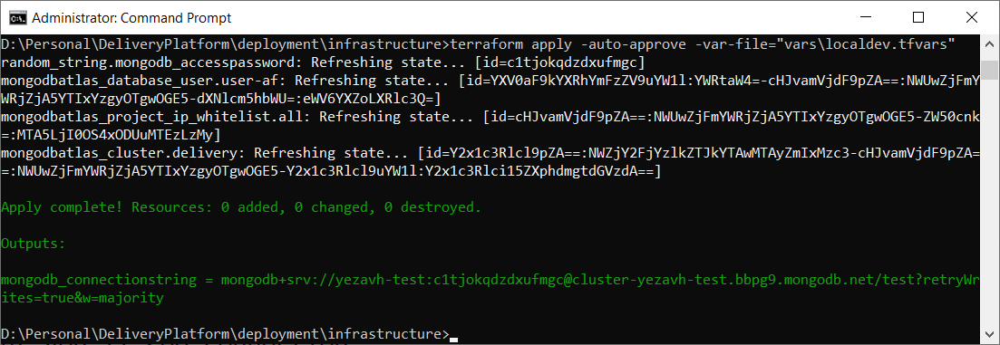

## Prerequisuites 

- terraform 0.12.0

## Run

- terraform init
- fill vars\localdev.tfvars
- terraform apply -auto-approve -var-file="vars\localdev.tfvars"

Apply will run for a while (10+ minutes) and create cluster for you, configure user to access the cluster and whitelist IP. 

In TF output you'll see connection 

