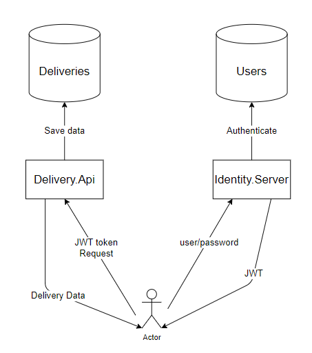

Architecturally I'd like to separate auth concern from api and busines logic. So, overally system will have two major microservice with their own database:

- Identity - which will be responsible to authenticate user and produce a JWT with claims (User or Partner)
- DeliveryApi - which will be responsible to deal with deliveries

As they logically different and serving different purposes I'd like to separate them as two different application. The code is flexible enough to combine them together if it's absolutely necessary. 

Identity will be standard Id v4 ASP.NET core project.

Delivery.Api will be standard ASP.NET Core WebAPI project.

Delivery.Api in current implementation also contains BackgroundService which is marking Deliveries in background as Expired. This way to implement cleaning task was choosen due to lack of time for implementation (https://docs.microsoft.com/en-us/dotnet/architecture/microservices/multi-container-microservice-net-applications/background-tasks-with-ihostedservice#deployment-considerations-and-takeaways). I think better solution would be moving this work in simple console application and run this as CronJob with some interval.

Authentication will be based on JWT token. Due to lack of time current implementation is using the same certificate key to generate and read token (see key Secret in AppSettings.json in both web projects). It's definitely not the most secure way to handle secrets but unless we're taking extra care on having secret encrypted in Identity and Delivery.Api we're more or less secure. 

Api projects are following onion architecture to separate different concerns and make easier to replace different aspects from each other.

- Web Layer (Delivery.csproj, Identity.Server.csproj) - is taking care only about getting request;
- Service interface layer (Delivery.Core.csproj, Identity.Core.csproj) - is taking care about business logic;
- DataLayer (Delivery.DataLayer.csproj, Identity.Core.csproj) - is taking care about how data should be persisted.
- Entity (namespace inside DataLayer.DataModels project) - have information about entities.