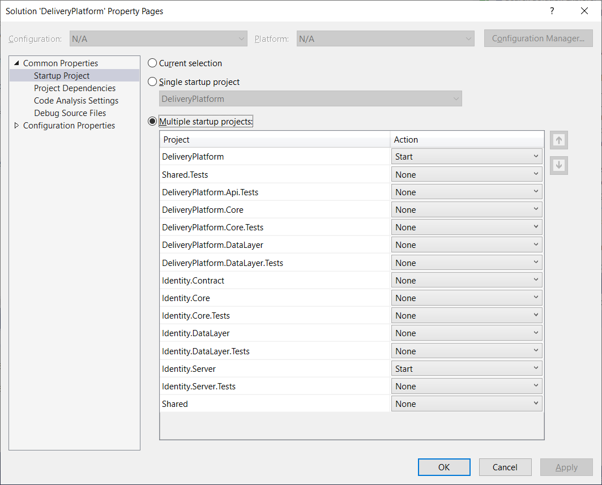

## Prerequisites

- .NET Core 3.1 SDK (https://dotnet.microsoft.com/download)
- Visual Studio (or any other IDE, most of examples will require VS to run)
- Postman (nice to have, see [Testing with Postman](TestingWithPostman.md))

## Visual Studio

With Visual Studio please set multiple startup projects (DeliveryPlatofrm and Identity.Server)

Please ensure that your appsettings.json have values for:

DeliveryPlatofrm:

- Secret

Identity.Server

- Secret

Note, "Secret" should be the same because Identity.Server use it to encrypt JWT and DeliveryPlatform use it to decrypt JWT

After this you can use api with Postman, curl or any convenient for you way.

By default Visual Studio is using Docker to launch the project:

Default DockerDefaultTargetOS is Linux, so highly likely you're receiving cross-platform version.