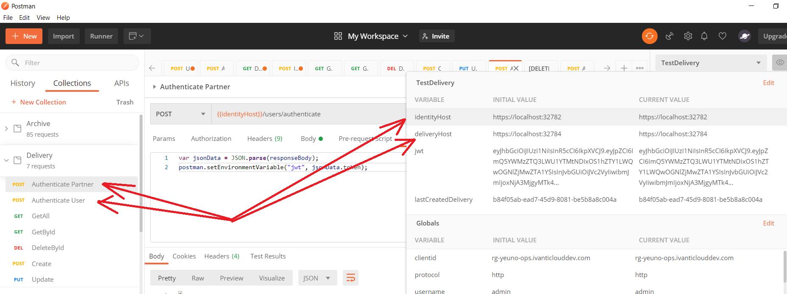

If you're using PostMan (https://www.postman.com/downloads/) you can download requests collection and environment setup from [collection](postman/Delivery.Tests) and [environment](TestDelivery.Environment).

After this you just need to setup identityHost with URL of deployed IdentityServer and deliveryHost with URL of deployed Delivery api. See example below:

